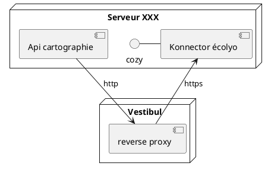

# API-Rest-Visualisation

The security of the api is based on Gin-JWT.

The connector of cozy sends the doctype information to the API. https://github.com/Debzou/cozy-konnector-output

Then this API allows the visualization of energy consumption on a map.



# Launch

## Start API in container :whale:
change url mongodb in main.go (mongodb://127.0.0.1:27017)
```
sudo chmod +x ./install.sh
sudo ./install.sh
```

## Start API without docker :space_invader:
change url mongodb in main.go (mongodb://mongo:27017/)

Prerequisite : 
- mongo client/server 

```sh
docker run -d -p 27017-27019:27017-27019 --name RESTmongo  mongo
```

- go lastest version

```sh
go mod init github.com/Debzou/REST-API-GO
go mod vendor
go run main.go
```

or 

```sh
sudo chmod +x ./packaged-api.sh
sudo ./packaged-api.sh
go run main.go
```
# The status

 When a user creates an account on the api, the user is automatically in "mormal_user".
 
- normal_user : this status prevents middleware authorization.

- admin : this status allows to use the middlware.

To have the administrator status, you have to log in to mongodb and modify your profile.

# Routes

The token must be put in (auth / bearer token)

Data must be in json format

Static file : css / js 
```sh
[GIN-debug] GET    /static/*filepath         --> github.com/gin-gonic/gin.(*RouterGroup).createStaticHandler.func1 (3 handlers)
[GIN-debug] HEAD   /static/*filepath         --> github.com/gin-gonic/gin.(*RouterGroup).createStaticHandler.func1 (3 handlers)
```

API visualisation (view)
```sh
[GIN-debug] GET    /datavis/index            --> github.com/Debzou/REST-API-GO/internal/controllers.Getindex (3 handlers)
[GIN-debug] GET    /datavis/geovis           --> github.com/Debzou/REST-API-GO/internal/controllers.GetGeoVis (3 handlers)
```

Routes Protected 
```sh
[GIN-debug] GET    /auth/refresh_token       --> github.com/appleboy/gin-jwt/v2.(*GinJWTMiddleware).RefreshHandler-fm (3 handlers)
[GIN-debug] GET    /auth/hello               --> github.com/Debzou/REST-API-GO/internal/controllers.HelloHandler (4 handlers)
[GIN-debug] POST   /auth/consumption         --> github.com/Debzou/REST-API-GO/internal/controllers.PostConsumption (4 handlers)
```

Login / Signup 
```sh
[GIN-debug] POST   /signup                   --> github.com/Debzou/REST-API-GO/internal/controllers.CreateUser (3 handlers)
[GIN-debug] POST   /login                    --> github.com/appleboy/gin-jwt/v2.(*GinJWTMiddleware).LoginHandler-fm (3 handlers)
```
## Exemple POST http/Curl

### POST /signup

```http
POST /signup HTTP/1.1
Host: localhost:8080
Content-Type: application/json

{
    "username" : "debzou",
    "password" : "debzou",
}
```
Using Curl

```sh
curl --location --request POST 'localhost:8080/signup' \
--header 'Content-Type: application/json' \
--data-raw '{
    "username" : "debzou",
    "password" : "debzou",
}'
```

### POST /login

```http
POST /login HTTP/1.1
Host: localhost:8080
Content-Type: application/json

{
    "password":"adminAAAaakkkk",
    "username":"admin55kkklll"
}
```

Using Curl

```sh
curl --location --request POST 'localhost:8080/login' \
--header 'Content-Type: application/json' \
--data-raw '{
    "password":"adminAAAaakkkk",
    "username":"admin55kkklll"
}'
```

### POST /auth/consumption

```http
POST /auth/consumption HTTP/1.1
Host: localhost:8080
Authorization: Bearer yourtoken
Content-Type: application/json

{
    "pseudo": "test",
    "latitude": 55.5,
    "longitude": 10.6,
    "averagedailyconsumption": 3000.0,
    "averagemonthlyconsumption": 500.5,
    "averageannualconsumption": 600.0
}
```
Using Curl

```sh
curl --location --request POST 'localhost:8080/auth/consumption' \
--header 'Authorization: Bearer yourtoken \
--header 'Content-Type: application/json' \
--data-raw '{
    "pseudo": "test",
    "latitude": 55.5,
    "longitude": 10.6,
    "averagedailyconsumption": 3000.0,
    "averagemonthlyconsumption": 500.5,
    "averageannualconsumption": 600.0
}'
```


